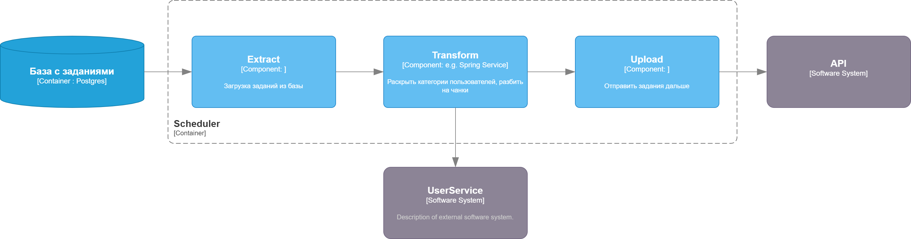

# Модуль отвечающий за генерацию автоматических событий



Модуль поллит базу данных, вытаскивает элементы, которые нужно обработать, преобразовывает категории пользоватлей в список пользователей, разбивает на чанки и отправляет в очередь на обработку

Чтобы запустить

```shell
python main.py
```